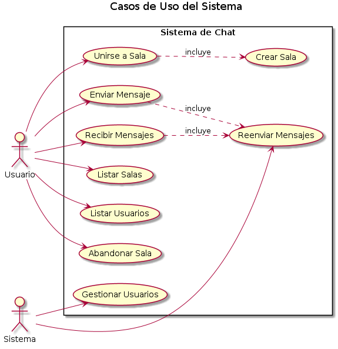
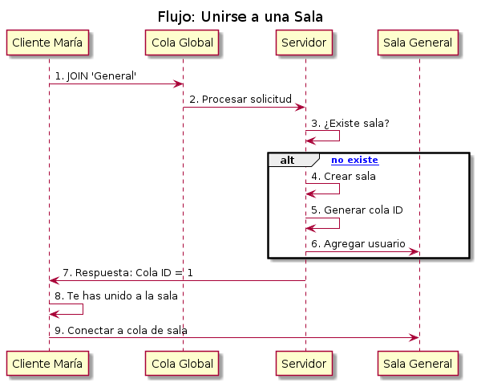
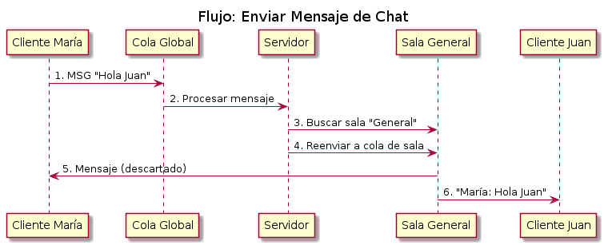

# Sistema de Chat con Colas de Mensajes
# Matías Martínez, Sofía Gallo, Juan Manuel Gallo

## Estructura del Proyecto

```
Parcial2_SistemasOperativos/
├── servidor.c              # Servidor central con colas de mensajes
├── cliente.c               # Cliente que se conecta al servidor
├── Makefile                # Makefile para compilar el proyecto
├── README.md               # Documentación del proyecto
└── test_msgqueue.sh        # Script de prueba con instrucciones
```

## Compilación e Instalación

### Prerrequisitos

```bash
# Instalar herramientas de desarrollo (Ubuntu/Debian)
sudo apt update
sudo apt install -y build-essential

# Verificar que GCC esté instalado
gcc --version
```

### Compilación

```bash
# Compilar el proyecto completo
make

# Compilar solo el servidor
make servidor

# Compilar solo el cliente
make cliente

# Limpiar archivos compilados
make clean

# Limpiar colas de mensajes del sistema (si hay problemas)
make clean-queues
```

## Ejecución del Sistema

### 1. Ejecutar el Servidor

```bash
./servidor
```

**Salida esperada:**
```
Servidor de chat iniciado. Esperando clientes...
```

### 2. Ejecutar Clientes (en terminales separadas)

```bash
# Terminal 2 - Cliente María
./cliente María

# Terminal 3 - Cliente Juan  
./cliente Juan

# Terminal 4 - Cliente Camila
./cliente Camila
```

**Salida esperada del cliente:**
```
Bienvenido, María. Salas disponibles: General, Deportes
>
```

## Comandos Disponibles

| Comando | Descripción | Ejemplo |
|---------|-------------|---------|
| `join <sala>` | Unirse a una sala específica | `join General` |
| `<mensaje>` | Enviar mensaje a la sala actual | `Hola a todos!` |
| `/list` | Listar todas las salas disponibles | `/list` |
| `/users` | Listar usuarios en la sala actual | `/users` |
| `/leave` | Abandonar la sala actual | `/leave` |
| `Ctrl+C` | Salir del programa | - |


## Arquitectura del Sistema

### Diagramas del Sistema

#### Casos de Uso del Sistema


#### Flujo: Unirse a una Sala


#### Flujo: Enviar Mensaje de Chat


### Componentes Principales

#### Servidor Central (`servidor.c`)
- Gestiona todo el sistema de chat
- Crea y gestiona colas de mensajes para cada sala
- Recibe mensajes de los clientes y los reenvía a todos los miembros de la sala
- Gestiona la lista de salas y usuarios en cada sala
- Utiliza una cola global para solicitudes de clientes

#### Cliente (`cliente.c`)
- Interfaz de usuario para el chat
- Se conecta al servidor mediante la cola global
- Se une a salas específicas
- Envía mensajes a la sala actual
- Recibe mensajes de otros usuarios mediante un hilo separado

### Flujo de Comunicación

1. Cliente envía mensaje JOIN a la cola global
2. Servidor procesa la solicitud y crea/encuentra la sala
3. Servidor responde con el ID de la cola de la sala
4. Cliente se conecta a la cola de la sala
5. Cliente envía mensajes a la cola global
6. Servidor reenvía mensajes a la cola de la sala
7. Todos los clientes de la sala reciben el mensaje

## Cómo Funciona el Sistema

Este chat funciona como **WhatsApp pero para la terminal**. El servidor es como el "cerebro" que maneja todo, y los clientes son como los celulares que se conectan.

**Lo que hace especial a nuestro código:**

- **Cada sala es independiente**: Como tener grupos separados de WhatsApp, cada uno con su propia "conversación"
- **Mensajes en tiempo real**: Usamos hilos para que puedas escribir y recibir mensajes al mismo tiempo
- **Se crean salas automáticamente**: Si escribes "join Musica" y no existe, se crea sola
- **No se mezclan los mensajes**: Cada sala tiene su propia "caja de mensajes" separada
- **Maneja errores**: Si alguien ya tiene tu nombre o la sala está llena, te avisa

**Lo técnico que aprendimos:**
Usamos colas de mensajes de Linux (como buzones de correo entre programas) y cada sala tiene su propio buzón único para que los mensajes no se confundan. También usamos hilos para que puedas chatear sin que se "cuelgue" el programa.

