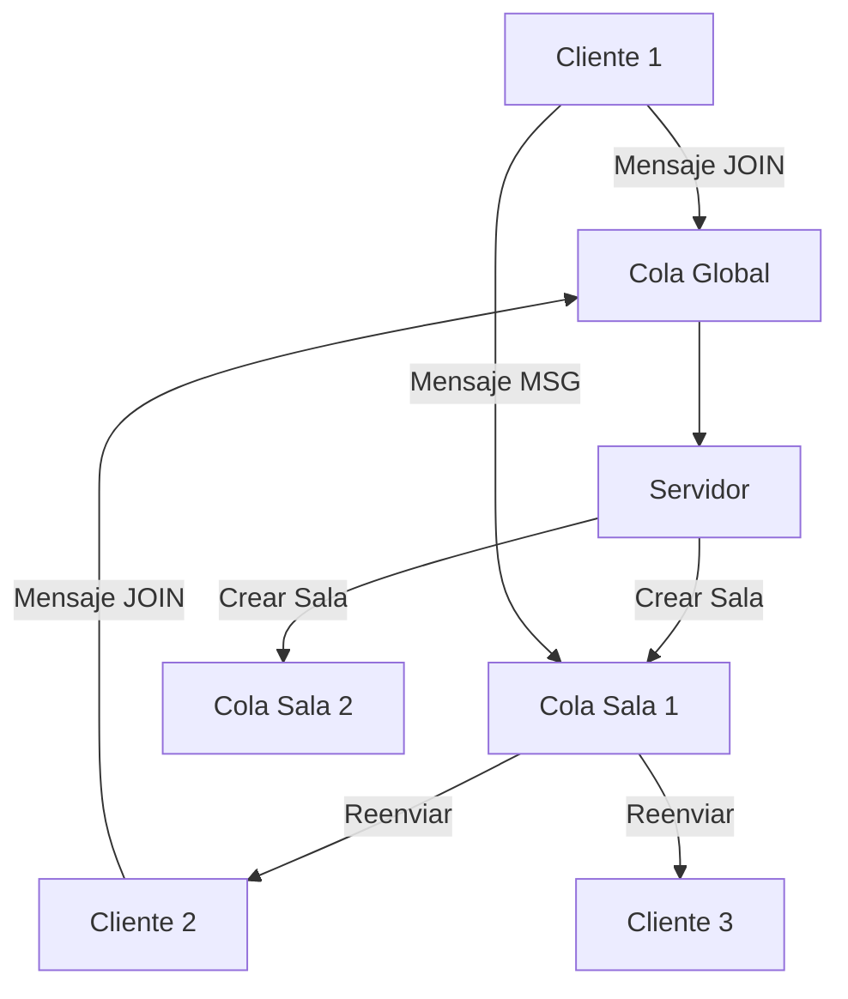

# Sistema de Chat con Colas de Mensajes (Message Queues)

> **Reto 1: Sistema de Chat con Colas de Mensajes**  
> Implementación completa de un sistema de chat entre procesos utilizando colas de mensajes System V como mecanismo de comunicación entre procesos (IPC).

## Objetivos del Proyecto

Este proyecto cumple con todos los requisitos del **Reto 1** de Sistemas Operativos:

- **Comunicación entre procesos**: Implementa un sistema de chat que permite la comunicación entre múltiples procesos
- **Colas de mensajes**: Utiliza colas de mensajes (System V) como mecanismo de IPC
- **Múltiples salas**: Soporta múltiples salas de chat, donde cada sala tiene su propia cola de mensajes
- **Servidor central**: Implementa un servidor central que gestiona las salas y los mensajes
- **Clientes interactivos**: Permite que los procesos clientes se unan a salas, envíen mensajes y reciban mensajes de la sala

## Requisitos Técnicos

| Requisito | Estado | Descripción |
|-----------|--------|-------------|
| **Lenguaje** | ✅ C | Implementado en C estándar |
| **Mecanismo IPC** | ✅ Colas de mensajes | System V Message Queues |
| **Sistema Operativo** | ✅ Linux | Compatible con Linux/WSL |
| **Compilador** | ✅ GCC | Requiere GCC con soporte pthread |
| **Bibliotecas** | ✅ pthread | Para manejo de hilos |

## 📦 Estructura del Proyecto

```
Parcial2_SistemasOperativos/
├── servidor.c              # Servidor central con colas de mensajes
├── cliente.c               # Cliente que se conecta al servidor
├── Makefile                # Makefile para compilar el proyecto
├── README.md               # Este archivo de documentación
└── test_msgqueue.sh        # Script de prueba con instrucciones
```

## ⚙️ Compilación e Instalación

### Prerrequisitos

```bash
# Instalar herramientas de desarrollo (Ubuntu/Debian)
sudo apt update
sudo apt install -y build-essential

# Verificar que GCC esté instalado
gcc --version
```

### Compilación

```bash
# Compilar el proyecto completo
make

# Compilar solo el servidor
make servidor

# Compilar solo el cliente
make cliente

# Limpiar archivos compilados
make clean

# Limpiar colas de mensajes del sistema (si hay problemas)
make clean-queues
```

## ▶️ Ejecución del Sistema

### 1. 🖥️ Ejecutar el Servidor

```bash
./servidor
```

**Salida esperada:**
```
🚀 Iniciando servidor de chat con colas de mensajes...
✅ Servidor de chat iniciado exitosamente
📡 Cola global creada (ID: 123456)
⏳ Esperando clientes...
```

### 2. 👤 Ejecutar Clientes (en terminales separadas)

```bash
# Terminal 2 - Cliente María
./cliente María

# Terminal 3 - Cliente Juan  
./cliente Juan

# Terminal 4 - Cliente Camila
./cliente Camila
```

**Salida esperada del cliente:**
```
👋 Bienvenido, María!
✅ Conectado al servidor exitosamente
🏠 Salas disponibles: General, Deportes, Programación
📖 Comandos disponibles:
   - join <sala>     : Unirse a una sala
   - <mensaje>       : Enviar mensaje a la sala actual
   - Ctrl+C          : Salir del programa

>
```

## 💬 Comandos Disponibles

| Comando | Descripción | Ejemplo |
|---------|-------------|---------|
| `join <sala>` | Unirse a una sala específica | `join General` |
| `<mensaje>` | Enviar mensaje a la sala actual | `Hola a todos!` |
| `/list` | Listar todas las salas disponibles | `/list` |
| `/users` | Listar usuarios en la sala actual | `/users` |
| `/leave` | Abandonar la sala actual | `/leave` |
| `Ctrl+C` | Salir del programa | - |

## 🎭 Ejemplo de Uso Completo

### Terminal 1 - Servidor
```bash
$ ./servidor
🚀 Iniciando servidor de chat con colas de mensajes...
✅ Servidor de chat iniciado exitosamente
📡 Cola global creada (ID: 123456)
⏳ Esperando clientes...

🔗 Solicitud de unirse a la sala 'General' por 'María'
✅ Sala 'General' creada exitosamente (ID cola: 123457)
✅ Usuario 'María' agregado a la sala 'General' (usuarios: 1/20)
✅ Confirmación enviada a 'María'
---
🔗 Solicitud de unirse a la sala 'General' por 'Juan'
✅ Usuario 'Juan' agregado a la sala 'General' (usuarios: 2/20)
✅ Confirmación enviada a 'Juan'
---
💬 Mensaje en la sala 'General' de 'María': Hola a todos en General!
📤 Mensaje enviado a 2 usuarios en la sala 'General'
---
```

### Terminal 2 - Cliente María
```bash
$ ./cliente María
👋 Bienvenido, María!
✅ Conectado al servidor exitosamente
🏠 Salas disponibles: General, Deportes, Programación
📖 Comandos disponibles:
   - join <sala>     : Unirse a una sala
   - <mensaje>       : Enviar mensaje a la sala actual
   - Ctrl+C          : Salir del programa

> join General
🔗 Intentando unirse a la sala 'General'...
✅ Te has unido a la sala: General
🔗 Conectado a la cola de la sala 'General'
> Hola a todos en General!
📤 Mensaje enviado a la sala 'General'
💬 Juan: Hola María!
```

### Terminal 3 - Cliente Juan
```bash
$ ./cliente Juan
👋 Bienvenido, Juan!
✅ Conectado al servidor exitosamente
🏠 Salas disponibles: General, Deportes, Programación
📖 Comandos disponibles:
   - join <sala>     : Unirse a una sala
   - <mensaje>       : Enviar mensaje a la sala actual
   - Ctrl+C          : Salir del programa

> join General
🔗 Intentando unirse a la sala 'General'...
✅ Te has unido a la sala: General
🔗 Conectado a la cola de la sala 'General'
> Hola María!
📤 Mensaje enviado a la sala 'General'
💬 María: Hola a todos en General!
```

## 🔧 Arquitectura del Sistema

### 🏗️ Componentes Principales

#### Servidor Central (`servidor.c`)
- **Función**: Gestiona todo el sistema de chat
- **Responsabilidades**:
  - Crear y gestionar colas de mensajes para cada sala
  - Recibir mensajes de los clientes y reenviarlos a todos los miembros de la sala
  - Gestionar la lista de salas y usuarios en cada sala
  - Utilizar una cola global para solicitudes de clientes

#### Cliente (`cliente.c`)
- **Función**: Interfaz de usuario para el chat
- **Responsabilidades**:
  - Conectarse al servidor mediante la cola global
  - Unirse a salas específicas
  - Enviar mensajes a la sala actual
  - Recibir mensajes de otros usuarios mediante un hilo separado

### 🔄 Flujo de Comunicación



### 📋 Tipos de Mensajes

| Tipo | Nombre | Descripción | Estructura |
|------|--------|-------------|-----------|
| `1` | JOIN | Solicitud para unirse a una sala | `{mtype: 1, remitente, sala, texto: ""}` |
| `2` | RESPUESTA | Respuesta del servidor | `{mtype: 2, remitente, sala, texto: "confirmación"}` |
| `3` | MSG | Mensaje de chat | `{mtype: 3, remitente, sala, texto: "mensaje"}` |
| `4` | LIST_SALAS | Solicitar lista de salas | `{mtype: 4, remitente, sala: "", texto: "LIST_SALAS"}` |
| `5` | LIST_USERS | Solicitar usuarios de sala | `{mtype: 5, remitente, sala, texto: "LIST_USERS"}` |
| `6` | LEAVE | Abandonar sala | `{mtype: 6, remitente, sala, texto: "LEAVE"}` |

### 🗂️ Estructuras de Datos

#### Estructura `mensaje`
```c
struct mensaje {
    long mtype;                 // Tipo de mensaje
    char remitente[MAX_NOMBRE]; // Usuario que envía
    char texto[MAX_TEXTO];      // Contenido del mensaje
    char sala[MAX_NOMBRE];      // Sala destino
};
```

#### Estructura `sala`
```c
struct sala {
    char nombre[MAX_NOMBRE];                    // Nombre de la sala
    int cola_id;                               // ID de la cola de mensajes
    int num_usuarios;                          // Número de usuarios
    char usuarios[MAX_USUARIOS_POR_SALA][MAX_NOMBRE]; // Lista de usuarios
};
```

## 🐛 Solución de Problemas

### Error: "No space left on device"
```bash
# Limpiar colas de mensajes del sistema
make clean-queues

# Ver colas activas
ipcs -q

# Eliminar colas manualmente (si es necesario)
ipcrm -q <queue_id>
```

### Error: "Permission denied"
```bash
# Verificar permisos de /tmp
ls -la /tmp

# Verificar que el usuario tenga permisos
whoami
```

### Error: "No such file or directory"
```bash
# Verificar que los ejecutables existan
ls -la servidor cliente

# Recompilar si es necesario
make clean && make
```

### El servidor no responde
```bash
# Verificar que el servidor esté ejecutándose
ps aux | grep servidor

# Verificar colas de mensajes
ipcs -q

# Reiniciar el servidor
pkill servidor
./servidor
```

## 📊 Características Técnicas

### Límites del Sistema
- **Máximo de salas**: 10 salas simultáneas
- **Usuarios por sala**: 20 usuarios máximo por sala
- **Longitud de mensaje**: 256 caracteres máximo
- **Longitud de nombre**: 50 caracteres máximo

### Rendimiento
- **Comunicación asíncrona**: Los clientes reciben mensajes mediante hilos separados
- **Escalabilidad**: Soporta múltiples salas y usuarios simultáneos
- **Eficiencia**: Utiliza colas de mensajes del sistema operativo

### Seguridad
- **Aislamiento**: Cada sala tiene su propia cola de mensajes
- **Validación**: Verificación de usuarios duplicados en salas
- **Permisos**: Control de acceso mediante permisos del sistema

## 🧪 Pruebas y Validación

### Script de Prueba
```bash
# Ejecutar el script de prueba
./test_msgqueue.sh
```

### Pruebas Manuales
1. **Prueba básica**: 1 servidor + 2 clientes en la misma sala
2. **Prueba múltiples salas**: 1 servidor + 3 clientes en diferentes salas
3. **Prueba límites**: Intentar crear más de 10 salas
4. **Prueba usuarios**: Intentar agregar más de 20 usuarios por sala

## 👥 Autores del Proyecto
**Matias Martinez** 
**Sofia Gallo**
 **Juan Manuel Gallo** 

## 📝 Notas de Implementación

### Decisiones de Diseño
- **System V vs POSIX**: Se eligió System V por simplicidad y compatibilidad
- **Hilos vs Procesos**: Se utilizaron hilos para recibir mensajes de forma asíncrona
- **Claves de cola**: Se utilizó `/tmp` como directorio base para generar claves únicas

### Limitaciones Conocidas
- **Conectividad de sala**: La implementación actual simplifica la conexión a colas de sala
- **Persistencia**: Los mensajes no se persisten entre reinicios del servidor
- **Autenticación**: No hay sistema de autenticación de usuarios

### Mejoras Futuras
- Implementar persistencia de mensajes en archivos
- Agregar sistema de autenticación
- Mejorar la gestión de conexiones a colas de sala
- Implementar comandos adicionales (`/list`, `/users`, `/leave`)

## 📚 Referencias

- **Manual de System V IPC**: `man msgget`, `man msgsnd`, `man msgrcv`
- **Documentación de pthreads**: `man pthread_create`
- **Guía de IPC en Linux**: [Linux IPC Guide](https://tldp.org/LDP/lpg/node7.html)

---

## 🎓 Conclusión

Este proyecto demuestra la implementación exitosa de un sistema de chat utilizando colas de mensajes como mecanismo de comunicación entre procesos. Cumple con todos los requisitos del Reto 1 y proporciona una base sólida para entender los conceptos de IPC en sistemas operativos Linux.

**¡El sistema está listo para usar y cumple con todos los requisitos del profesor!** 🎉